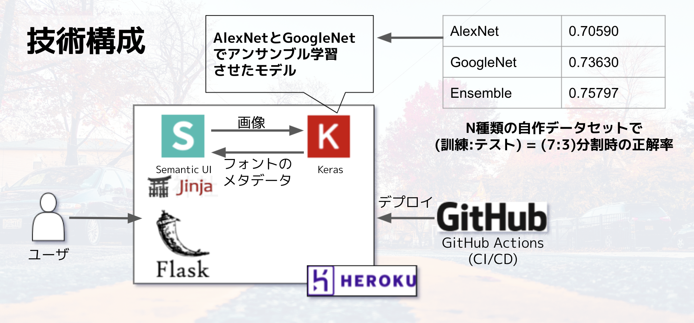

## sort-fontのアーキテクチャ
sort-fontはフロントエンド及びサーバエンドがPythonで完結しています。



ユーザがページにアクセスすると、`server.py` で定義された `@app.route()`の定義に従ってルーティングが行われます。
現在のルーティングルールは大きく分けて3つです。

- GET /
  - `index.html`をサーブします
- POST /upload
  - 画像を受け取り、判定結果を返却して `result.html` にリダイレクトします
- POST /crop_image
  - 画像を切り取った際のダミーリクエストを送ります

## ディレクトリ構成
```
./
├── Dockerfile          # Dockerコンテナのビルドに利用
├── Makefile            # コマンドまとめ
├── README.md           # アプリケーションの概要
├── app.json            # Herokuの設定
├── docs                # ドキュメント類
├── heroku.yml          # Herokuの設定
├── model               # 学習済のモデル
├── model.py            # 判定のコア機能を実装したファイル
├── requirements.txt    # 依存しているpipのパッケージ類
├── server.py           # Flaskサーバを実装したファイル
├── static              # 静的なファイル類
└─── templates           # Jinja2で利用するテンプレートファイル
```
